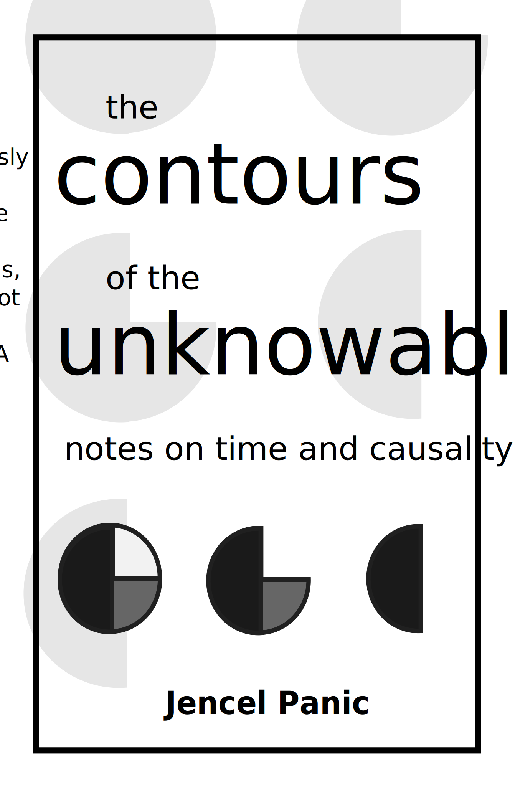

> To reconcile this paradox, we should consider what truth really is, as our current everyday notion of it is obviously wrong - truth does not exist in the world, truth is subjective. Reality is like a canvas that contains the form of the world, but it is up to the observer, to us, to draw the _contours_: we circle one spot and say "This is `A`". Then we take another picture and search for where `A` went, or for other instances of `A`. It is through these contours, that the unknowable, becomes knowable.

What if everything you believe about the world — every cause and effect, every memory, every sense of understanding — is a fragile mental construct, designed not to reveal the truth but to shield you from it? In _The Contours of the Unknowable_, we embark on a journey to dismantle these mental constructs and confront the chaotic, uncertain nature of existence.

From the moment we are born, our minds begin to weave a narrative, piecing together the fragments of our experiences into a coherent story. This story, guided by the principle of causality, gives us a sense of control, a belief that we can predict and understand the world around us. Yet, as Jencel Panic reveals, this sense of control is a deceptive one. Our memories, far from being accurate representations of past events, are shaped by the very mental images that distort our understanding of the present. The stories we tell ourselves are comforting, but they are also limiting, boxing us into a deterministic worldview that leaves little room for the unexpected, the unexplainable, the truly real.

The roots of this illusion run deep. Drawing on Zen Buddhist philosophy, Jencel Panic explores how our minds, in their quest for stability, create rigid mental images that we mistake for reality. These images become dogmas, reinforcing themselves over time until they are nearly impossible to question. The more we rely on these images, the more disconnected we become from the true nature of the world, which is anything but orderly. In this book, we confront this disconnection head-on, peeling back the layers of illusion to reveal a world that is far more chaotic—and far more fascinating—than we could have ever imagined.

At the heart of this exploration is the concept of determinism, the belief that every event is the inevitable result of preceding causes. While this idea has driven much of human progress, from the development of physics to the creation of complex social systems, it is also a dangerous oversimplification. By treating the world as a predictable machine, we ignore the fundamental unpredictability of life. We create a mental model of reality that is neat and tidy, but utterly detached from the messy, entropic nature of the universe itself.

In the Zen tradition, the mind is likened to a mirror, reflecting the world as it truly is. But over time, our mirrors become clouded with preconceived notions, with expectations, with memories that no longer serve us. _The Contours of the Unknowable_ is an invitation to clear away the fog, to see the world with fresh eyes. It is a call to embrace uncertainty, to find freedom in the realization that we do not—and cannot—know everything.

This book is not just an intellectual exercise; it is a practical guide to living more fully in the present moment. Through the insights of Zen Buddhism, cognitive science, and philosophy, Jencel Panic provides tools for breaking free from the mental constructs that bind us. By letting go of the need for order, we open ourselves to new possibilities, to a life that is richer, more vibrant, and more in tune with the true nature of existence.

