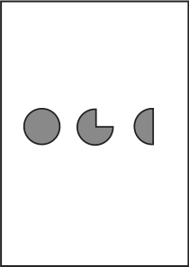

These texts are a result of me spending several years of pondering on the topic of time and causality. I mostly try to outline the results of different researchers in different disciplines of philosophy and science and to unify them into a common picture that represents the way that I see their work with some original ideas here and there. Abstract: the concepts of determinism, causality, time, and the world and the future are all strongly related. They constitute nothing but a framework that enables living organisms to survive in their environment, so we should not take them too seriously.

> If you find some errors in this novel, or you want to tell me how great it is, you can [mail me](mailto:marinovboris@gmail.com).

> To find out more about myself and my work, check [my blog](/).
